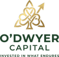

# O'Dwyer Capital - Website Assets Inventory

## Quick Reference

Your O'Dwyer Capital website assets are ready for use. This document outlines what you have and how to implement them.

---

## Logo Files

### Asset Inventory

| File | Dimensions | Use Case | Format |
|------|-----------|----------|--------|
| `favicon.png` | 32×32px | Browser tabs, bookmarks | PNG |
| `logo-small.png` | 100×100px | Website headers, footers, email | PNG |
| `logo-medium.png` | 200×200px | Hero sections, social media | PNG |
| `logo-large.png` | 400×400px | Print, presentations, large displays | PNG |
| `logo-main.png` | 2816×1536px | Master file, original quality | PNG |

**All files**: Transparent background, ready to use

---

## Website Template

### HTML Landing Page
- **File**: `index.html`
- **Status**: Ready to customize
- **Features**:
  - Responsive design (mobile-friendly)
  - Header with navigation
  - Hero section with logo
  - Feature cards
  - Footer

### How to Use
1. Open `index.html` in a web browser to preview
2. Edit HTML content to add your specific information
3. Update links in the navigation
4. Customize feature descriptions
5. Deploy to web hosting

### Customization Areas
- Navigation links (About, Services, Contact)
- Feature descriptions
- Contact/CTA button destination
- Footer information
- Company-specific details

---

## Color Implementation

### Primary Colors (CSS)
```css
/* Dark Green */
#1a4d2e

/* Gold/Tan Accent */
#d4a574

/* Secondary Green */
#2d6a4f
```

### Using Colors in HTML
```html
<!-- Dark green header -->
<header style="background-color: #1a4d2e; color: white;">

<!-- Gold buttons -->
<button style="background-color: #d4a574; color: #1a4d2e;">

<!-- Green text -->
<h1 style="color: #1a4d2e;">
```

---

## Integration Quick Start

### Step 1: Set Up Directory
Create this folder structure:
```
O'Dwyer Capital/
├── index.html
├── favicon.png
├── logo-small.png
├── logo-medium.png
├── logo-large.png
├── logo-main.png
├── assets/
│   ├── css/
│   │   └── style.css (optional, currently in HTML)
│   └── images/
│       └── (additional images)
```

### Step 2: Update HTML
Edit `index.html` with your actual content:
- Company description
- Services/features
- Contact information
- Links to actual pages

### Step 3: Add Web Hosting
1. Create account on hosting provider (Netlify, Vercel, GitHub Pages, etc.)
2. Upload all files
3. Set `index.html` as homepage
4. Configure domain name

### Step 4: Test & Deploy
- Test on desktop browsers (Chrome, Safari, Firefox, Edge)
- Test on mobile devices
- Verify logo displays correctly
- Check all links work

---

## Next Steps for Complete Website

### Additional Pages Needed
- **About Page**: Company history, mission, team
- **Services Page**: Detailed service offerings
- **Contact Page**: Contact form, contact information
- **Blog/Resources**: Articles, market insights

### Enhancement Recommendations
1. **Professional Photography**: Team photos, office images
2. **Additional Colors**: Develop full color palette variations
3. **Icon Set**: Small icons for features/benefits
4. **Typography System**: Complete font sizes and weights
5. **Style Guide**: Comprehensive CSS/design system

### Features to Add
- Contact form functionality
- Newsletter signup
- Social media links
- Search functionality
- Analytics tracking

---

## Email Signature Template

Use this as a starting point for email signatures:

```html
<table style="border-collapse: collapse;">
  <tr>
    <td style="padding-right: 20px;">
      
    </td>
    <td style="border-left: 2px solid #d4a574; padding-left: 20px;">
      <p style="margin: 0; font-weight: bold; color: #1a4d2e;">Your Name</p>
      <p style="margin: 5px 0; color: #666;">Your Title</p>
      <p style="margin: 5px 0; color: #666;">O'Dwyer Capital</p>
      <p style="margin: 5px 0; color: #d4a574; font-size: 12px;">Invested in What Endures</p>
    </td>
  </tr>
</table>
```

---

## Social Media Setup

### Profile Image
- Use `logo-medium.png` (200×200px)
- Fits most platforms (LinkedIn, Twitter, Facebook)
- Maintains clarity at small sizes

### Recommended Platforms
- LinkedIn (professional network)
- Twitter/X (market insights, updates)
- Facebook (general audience)
- Instagram (visual content, behind-the-scenes)

### Profile Bio Template
```
O'Dwyer Capital 
🌱 Family Investment Office
📈 Invested in What Endures
[Website Link]
```

---

## Print Collateral

### Business Cards
- Size: 3.5" × 2" (standard)
- Logo placement: Top right or centered
- Use `logo-medium.png` or reduce proportionally
- Include: Name, title, phone, email, website

### Letterhead
- Logo placement: Top left or centered top
- Size: Use `logo-small.png` or `logo-medium.png`
- Include: Company name, address, phone, email, website

### Marketing Materials
- Brochures: `logo-large.png` for impact
- Flyers: `logo-medium.png` with 20px clear space
- Presentations: Scale logos proportionally

---

## File Integrity Checklist

✓ **Logo files verified**
- All PNG files with transparent backgrounds
- Correct dimensions per filename
- High quality, ready for web and print

✓ **HTML template ready**
- Responsive design implemented
- Color scheme integrated
- Navigation structure in place

✓ **Documentation complete**
- Brand guidelines provided
- Implementation instructions included
- Asset inventory documented

---

## Support & Customization

### If You Need...

**Different logo sizes**
- Edit dimensions in brand guidelines
- Resize using web tools or image editor

**Additional color variations**
- Define new color codes in BRAND_GUIDELINES.md
- Update HTML/CSS with new values

**More pages/sections**
- Copy HTML structure from index.html
- Maintain color scheme and logo placement
- Keep consistent navigation

**Professional assistance**
- Consider hiring web designer for custom design
- Use existing assets as foundation
- Maintain brand consistency

---

## Deployment Options

### Free Options
- **GitHub Pages**: Free hosting, good for static sites
- **Netlify**: Free tier, excellent documentation
- **Vercel**: Free tier, optimized for modern web

### Paid Options
- **Bluehost**: Affordable, WordPress-friendly
- **Squarespace**: All-in-one website builder
- **Wix**: Drag-and-drop builder with good templates

### Quick Start with Netlify
1. Create Netlify account
2. Drag and drop your folder
3. Get instant URL
4. Connect domain name
5. Site goes live immediately

---

## Maintenance Schedule

### Monthly
- Check all links work
- Verify logo displays correctly
- Test on different browsers

### Quarterly
- Update content
- Review analytics
- Check mobile functionality

### Annually
- Update copyright year
- Review brand consistency
- Plan refreshes/updates

---

## Brand Asset Archive

All assets are stored in:
```
E:\Users\Steven\Documents\Claude\Projects\O'Dwyer Capital\
```

**Backup recommended**: Copy entire folder to cloud storage (OneDrive, Google Drive, Dropbox)

---

## Document Version
- **Created**: May 29, 2026
- **Version**: 1.0
- **Status**: Ready to implement
- **Last Updated**: May 29, 2026

---

## Next Actions
1. ✓ Review all asset files
2. ✓ Customize index.html
3. ✓ Test locally in browser
4. ✓ Choose hosting platform
5. ✓ Deploy website
6. ✓ Configure domain name
7. ✓ Set up analytics

Your O'Dwyer Capital brand is ready to launch! 🚀
